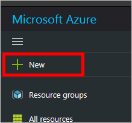
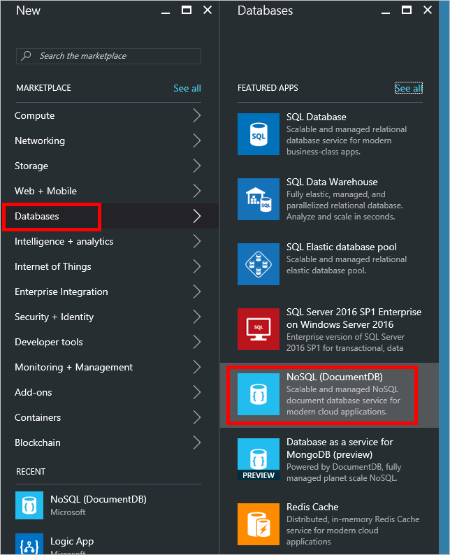
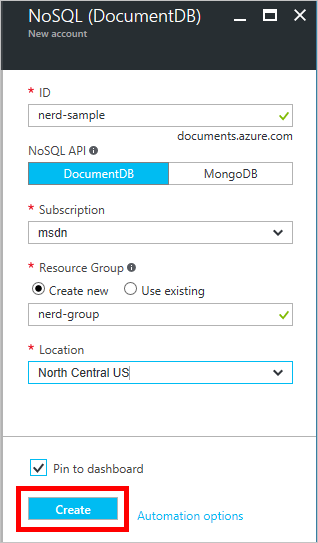
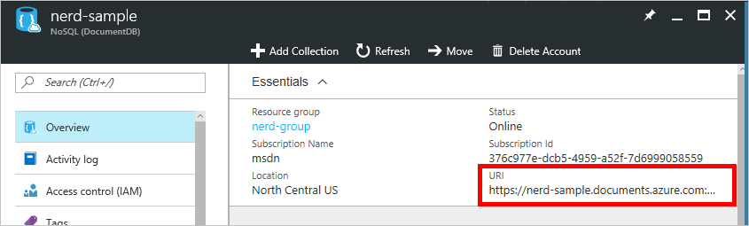
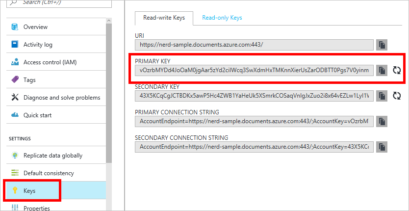
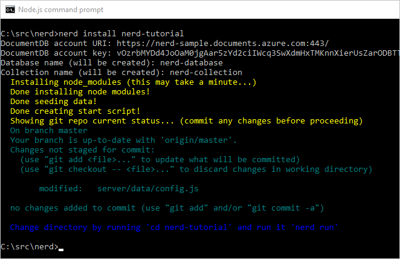
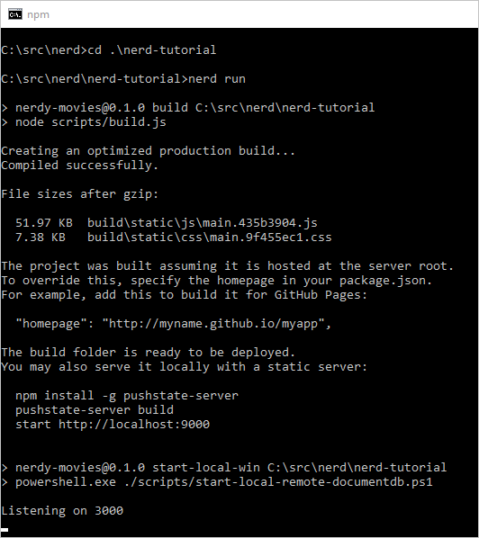
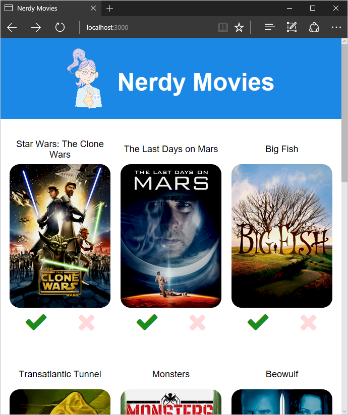

# Get started with NERD Stack

In this tutorial, we're going to walk you through using NERD Stack to build and deploy a sample application.  

**In this guide:**

- [Prerequisites](#prerequisites)
- [Setting up DocumentDB](#setting-up-documentdb)
- [Create and run the sample app](#create-the-sample-app)
- [Run the sample app](#run-the-sample-app)
- [Publish to Azure App Service](#publish-to-azure-app-service)
- [Cleanup the sample app](#cleanup-the-sample-app)

## Prerequisites

Before we get started, you'll need a few things:

* [Node.js](https://nodejs.org/)
* [NERD Stack](index.html#installation)
* The [Git](https://git-scm.com/) client
* A [Microsoft Azure](https://azure.microsoft.com) subscription.  You can [start for free](https://azure.microsoft.com/en-us/free/).

## Setting up DocumentDB

You'll need to create a DocumentDB account on Azure to store your data.

> **NOTE:** This tutorial uses the [Azure Portal](https://portal.azure.com) to create your DocumentDB account.  If you're more comfortable with a command line interface, you can also create your DocumentDB account through Azure's [cross-platform command-line interface](https://docs.microsoft.com/en-us/azure/xplat-cli-install?toc=%2fazure%2fvirtual-machines%2flinux%2ftoc.json) or [Azure PowerShell](https://docs.microsoft.com/powershell/).

1. Sign in to the [Azure Portal](https://portal.azure.com).

2. In the upper-left, click **New**.

    

3. In the flyout (Azure calls these *blades*), click **Databases**, and then click **NoSQL (DocumentDB)**.

    

4. In the **NoSQL (DocumentDB)** blade, complete the form as follows:
    
    - Give your DocumentDB account an **ID**. This will be part of the DocumentDB's URI.
    - Ensure *DocumentDB* is selected for **NoSQL API**.
    - Select your Azure **Subscription**.
    - Create a new **Resource Group**.  Note the name you assign it, as you'll need it later.
    - Select a **Location** for your DocumentDB account. 
    - Tick the **Pin to dashboard** checkbox.
    - Click **Create**.

    

    After a few seconds, your DocumentDB account will appear on your Azure Portal dashboard.  If you can't find it, or you forgot to tick the **Pin to dashboard** checkbox, you can find your DocumentDB account by clicking the hamburger button in the upper-left and then clicking **All resources**.  

5. Click your DocumentDB account.  In the blade that opens, first, under essentials, note the URI. It should be in the form `https://<your account ID>.documents.azure.com:443/`.

    

6. On that same blade, click the **Keys** tab.  Click the **Copy** icon next to the **Primary Key** field to copy the key to your clipboard.

    

    > **IMPORTANT!** Safeguard these keys. Anyone with these keys can access your DocumentDB account.

Your DocumentDB account is ready to use with NERD Stack.

## Create and run the sample app

Now you're ready to create your sample app.  

1. At a Node.js prompt, navigate to the directory you in which you want to create your app and enter:
    
    ```
    nerd install <app_name>
    ```

2. When prompted, enter the **DocumentDB account URI** you noted earlier.

3. Enter the **DocumentDB account key** you copied earlier.

4. Enter a **Database name**.

5. Enter a **Collection name**.

The NERD CLI will carry out several tasks automatically, including:

* Cloning the sample app (Nerdy Movies) into a new directory.
* Configuring the connection to your DocumentDB database.
* Creating and configuring the necessary npm scripts.



## Run the sample app

Now we can test the sample app to make sure it runs correctly.

1. Change your current directory to the subdirectory the install created in the previous step.  This will be the application name you entered at the command line in the previous section.

    **Windows**

    ```
    cd .\<app_name>
    ```

    **Linux**

    ```
    cd ./<app_name>
    ```

2. Build and run the web app by entering:

    ```
    nerd run
    ```
    
    This will create a production build of the web app and run the platform-appropriate start script.

    

3. Open a browser and test the web application by browsing to `http://localhost:3000`.

    

4. When you're ready to terminate the application, press **CTRL-C** in your terminal.


## Publish to Azure App Service

You can publish your NERD app to any server that runs Node.js.  Since we're already using Azure for DocumentDB, let's try the [Azure App Service](https://azure.microsoft.com/en-us/services/app-service/) to host our application.

First, let's get a list of available Azure regions.  We'll need to enter one in the next step.

```
nerd regions
```

Follow the authentication procedure to retrieve the list.  Note the lowercase name of the region you wish to create the app in.  

> **TIP:** Azure makes it easy to manage resouces that belong to the same application as a group. To take advantage of this, use the same location and resource group for your Azure App Service as you did for DocumentDB.

Now we're ready to get Azure App Service set up.  At the command line, enter:

```
nerd publish
```

Enter the following information when prompted:

- Skip **Tenant ID** unless you know you need it (necessary for certain types of Azure subscriptions)
- Enter the **DocumentDB URI** we used earlier.
- Enter the **DocumentDB key** we used earlier.
- Enter the **Location** (region) you chose earlier.
- Enter a **Resource group name**. 
- Enter a unique **Web app name**.  You can test to make sure it's unique by trying to browse to `<web-app-name>.azurewebsites.net`.
- Follow the authentication procedure as prompted to log in.
- Follow the procedure displayed in the output text to set your Git deployment credentials.


Now you've created an Azure App Service, so you can now push your app code to Azure.  Enter:

```
git push azure master
```

Your app will be uploaded, built, and ran in the cloud.  The process may take a few minutes.  When the process is complete, you can browse to `<web-app-name>.azurewebsites.net` to see your live app.


## Cleanup the sample app

The sample app is a great tool to understand how a NERD app works.  When you are ready to start your own custom app, execute the following:

```
nerd cleanup
```

This will remove the sample portions of the sample app, leaving you with a blank [Express](http://expressjs.com/) application with the dependencies for [React](https://facebook.github.io/react/) and [DocumentDB](https://azure.microsoft.com/services/documentdb/) preconfigured.
